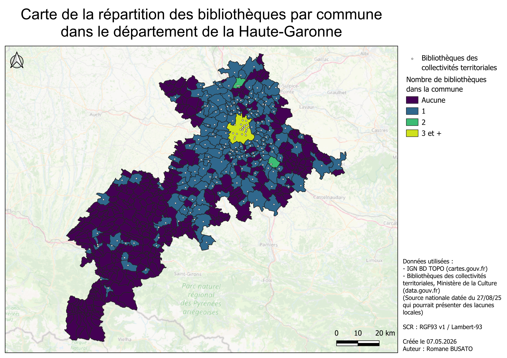
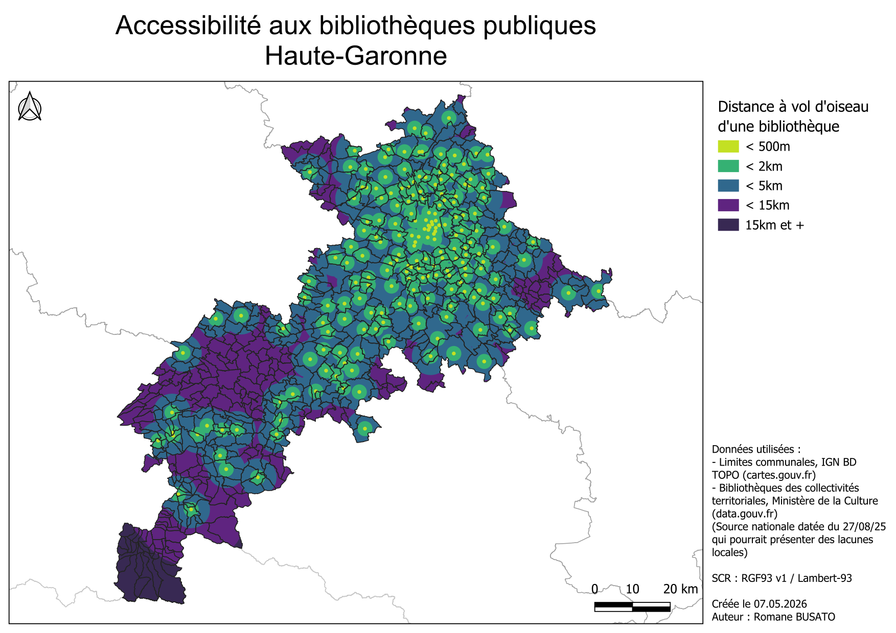

# Accessibilité aux bibliothèques publiques — Haute-Garonne

## Cartes

### Répartition par commune

### Zones d'accessibilité à vol d'oiseau

## Objectif
Analyser la répartition et l'accessibilité aux bibliothèques publiques 
dans le département de la Haute-Garonne (31).

## Données utilisées
- **IGN BD TOPO** — limites communales (cartes.gouv.fr)
- **Bibliothèques des collectivités territoriales** — Ministère de la Culture 
(data.gouv.fr, source nationale datée du 27/08/2025)

## Méthode
1. Jointure spatiale entre points bibliothèques et polygones communes 
   → comptage par commune → carte choroplèthe
2. Tampons progressifs (500m, 2km, 5km, 15km) autour de chaque bibliothèque 
   → découpe aux limites départementales → zones d'accessibilité

## Limites
La source nationale peut présenter des lacunes locales, 
notamment en zone rurale.

## Outils
QGIS · Lambert 93 (EPSG:2154) · IGN BD TOPO · data.gouv.fr
