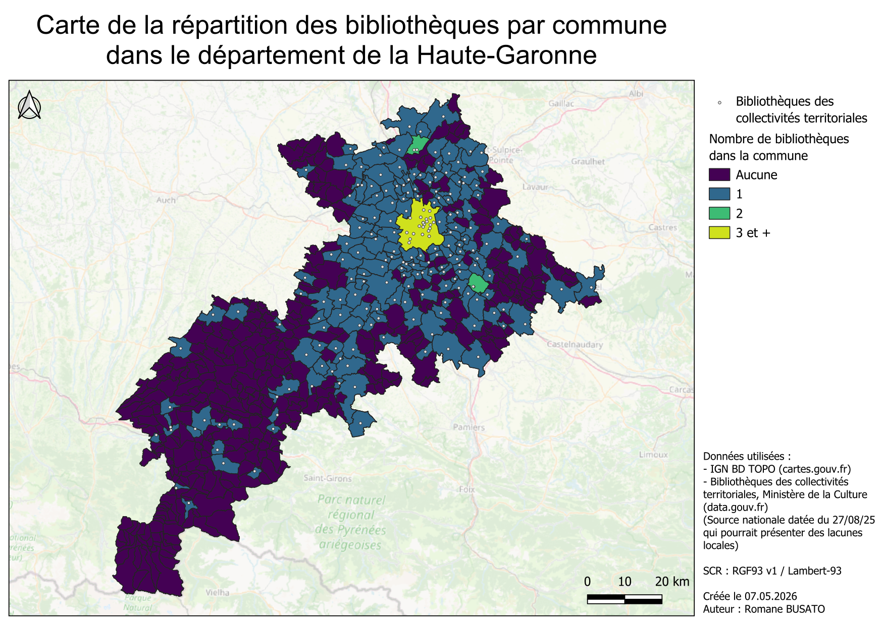
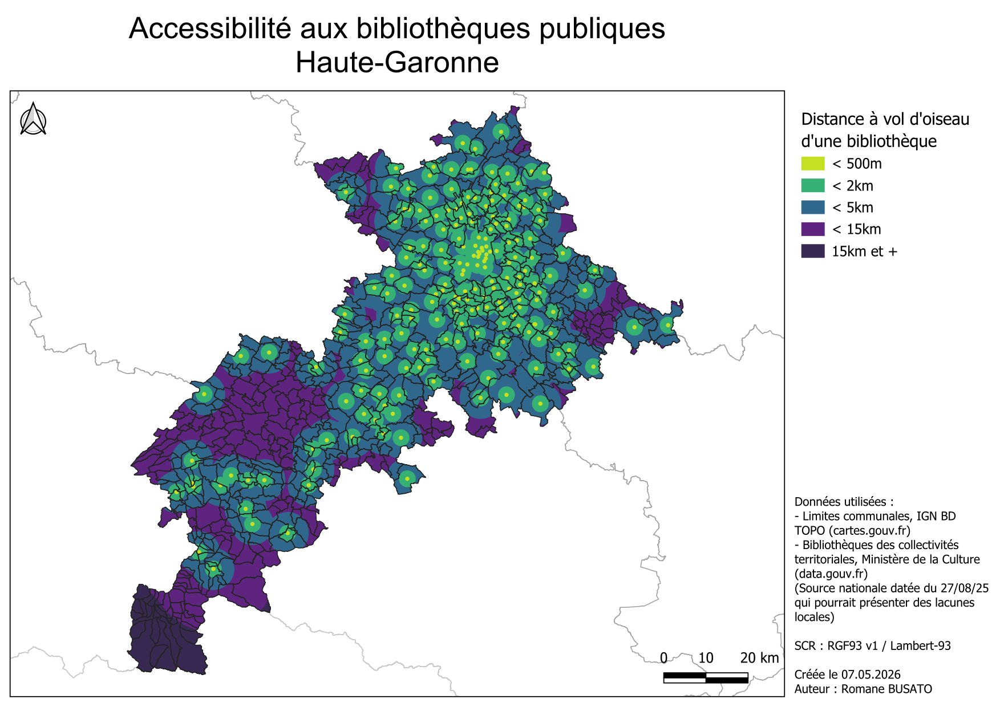
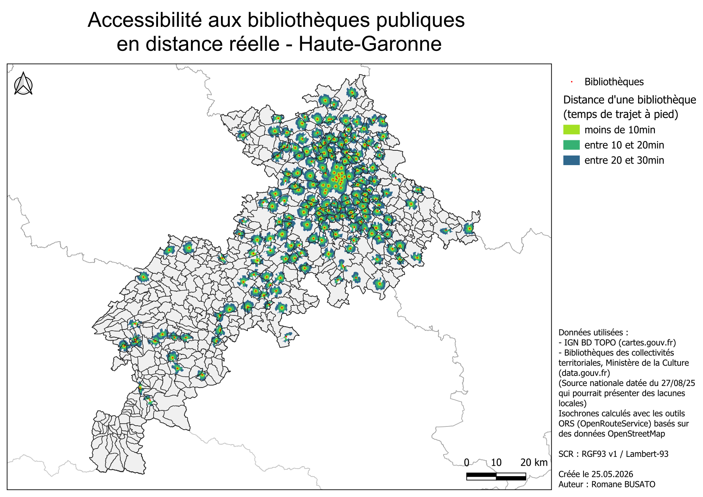

# Accessibilité aux bibliothèques publiques — Haute-Garonne

## Cartes

### Répartition par commune

Nombre de bibliothèques par commune (jointure spatiale)

### Zones d'accessibilité à vol d'oiseau

Distance à vol d'oiseau depuis une bibliothèque (tampons progressifs découpés aux limites du département)

### Accessibilité en temps de trajet réel

Distance à pied depuis une bibliothèque (isochrones calculés sur le réseau routier réel via OpenRouteService)

## Objectif
Analyser la répartition et l'accessibilité aux bibliothèques publiques 
dans le département de la Haute-Garonne (31).

## Approche méthodologique comparative
Les trois cartes illustrent une progression méthodologique :

- **Choroplèthe** — vue agrégée par commune, utile pour comparer les territoires entre eux
- **Tampons à vol d'oiseau** — approximation simple de l'accessibilité spatiale, rapide à produire
- **Isochrones temps réel** — méthode la plus précise, prend en compte le réseau routier et la topographie. 
  Les différences avec les tampons sont particulièrement visibles en zone rurale où le réseau routier est peu dense.

## Données utilisées
- **IGN BD TOPO** — limites communales (cartes.gouv.fr)
- **Bibliothèques des collectivités territoriales** — Ministère de la Culture 
(data.gouv.fr, source nationale datée du 27/08/2025)
- **Réseau routier** — OpenRouteService basé sur OpenStreetMap

## Méthode
1. Jointure spatiale entre points bibliothèques et polygones communes 
   → comptage par commune → carte choroplèthe
2. Tampons progressifs (500m, 2km, 5km, 15km) autour de chaque bibliothèque 
   → découpe aux limites départementales
3. Isochrones à pied (10, 20, 30 min) via plugin ORS Tools
   → regroupement par niveaux de temps → découpe aux limites départementales

## Limites
La source nationale peut présenter des lacunes locales, notamment en zone rurale.
Les tampons à vol d'oiseau ne tiennent pas compte du réseau routier ni de la topographie
Les isochrones sont basés sur OSM, leur qualité dépend de la complétude des données locales

## Analyse SQL avec PostgreSQL/PostGIS

Les mêmes analyses ont été reproduites en SQL spatial avec PostgreSQL/PostGIS, notamment :
- Comptage des bibliothèques par commune (jointure spatiale)
- Communes sans bibliothèque
- Bibliothèque la plus proche de chaque commune (CROSS JOIN LATERAL)
- Calcul de surfaces et distances

📄 [Script SQL commenté](analyse_postgis.sql)

## Outils
QGIS · ORS Tools · Lambert 93 (EPSG:2154) · IGN BD TOPO · data.gouv.fr · OpenRouteService · PostgreSQL/PostGIS
