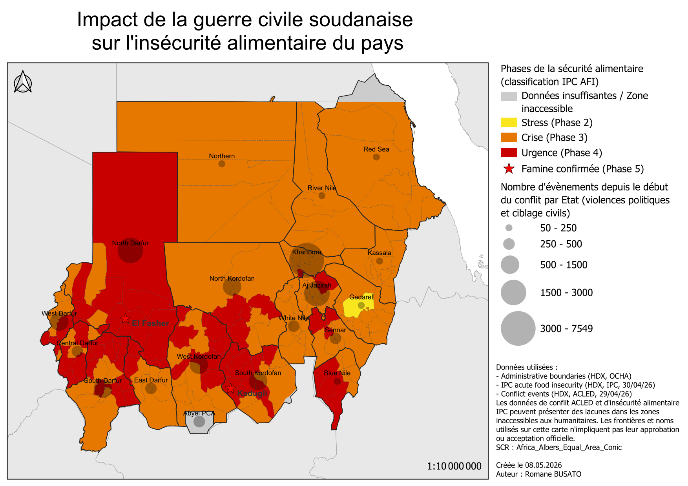
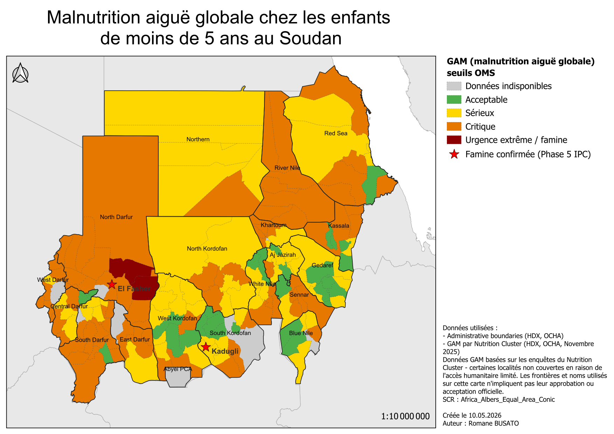

# Sécurité alimentaire et conflit au Soudan

## Contexte
Depuis le 15 avril 2023, le Soudan est plongé dans une guerre civile 
opposant les Forces Armées Soudanaises (FAS) aux Forces de Soutien 
Rapide (FSR). Le conflit a provoqué la pire crise humanitaire au monde, 
avec plus de 13 millions de déplacés (le pays est en tête du classement
mondial des crises de déplacement) et plus de 21 millions de personnes en 
situation d'insécurité alimentaire aiguë. La sécurité alimentaire du pays
est critique, avec 33 millions de personnes au bord de la famine, des zones 
de famine officiellement établies et une flambée des prix des denrées
alimentaires. 

Source : [Courrier International](https://www.courrierinternational.com/article/analyse-soudan-mille-jours-de-guerre-pour-un-pays-en-cendres_239265)

Comment la guerre civile soudanaise impacte la sécurité alimentaire de la 
population ?

## Cartes

### Carte 1 — Insécurité alimentaire et intensité du conflit

Phases IPC d'insécurité alimentaire par localité, superposées à 
l'intensité du conflit par État (nombre d'événements ACLED depuis 
avril 2023) et aux zones de famine confirmée.

### Carte 2 — Malnutrition aiguë globale (GAM)

Taux de malnutrition aiguë globale chez les enfants de moins de 5 ans 
par localité, selon les seuils OMS, données Nutrition Cluster novembre 2025.

## Données utilisées
- **Administrative boundaries** — [HDX, OCHA (COD-AB-SDN)](https://data.humdata.org/dataset/cod-ab-sdn)
- **IPC acute food insecurity** — [HDX, IPC, 30/04/2026](https://data.humdata.org/dataset/sudan-acute-food-insecurity-country-data)
- **Conflict events** — [HDX, ACLED, 29/04/2026](https://data.humdata.org/dataset/sudan-acled-conflict-data)
- **GAM/SAM rates** — [HDX, Nutrition Cluster, novembre 2025](https://data.humdata.org/dataset/gam-mam-and-sam-based-on-muac-measurements)
- **Limites des pays voisins** — [Natural Earth](https://www.naturalearthdata.com) 
  (domaine public), Admin 0 Countries, 1:10m

## Méthode
- Formatage des jeux de données (filtrage des données ACLED par date
  et filtrage de certains états du Soudan du SUD, format des données
  numériques en accord avec les formats reconnus QGIS, export en csv)
- Jointure attributaire des données IPC et GAM sur les limites 
  administratives via PCODE
- Agrégation des événements ACLED par État depuis le 15/04/2023
- Représentation en cercles proportionnels pour l'intensité du conflit
- Seuils IPC et OMS pour la classification de la sécurité alimentaire 
  et de la malnutrition
- Projection : Africa Albers Equal Area Conic

## Limites des données
- Les données IPC, GAM et ACLED peuvent présenter des lacunes dans 
  les zones inaccessibles aux humanitaires, notamment au Darfour, 
  Kordofan et Kereneik (West Darfur)
- Abyei PCA : [zone administrative disputée entre le Soudan et le 
  Soudan du Sud](https://press.un.org/fr/2024/cs15889.doc.htm) — aucune donnée disponible
- Hala'ib : territoire disputé entre le Soudan et l'Égypte dont le
  statut est non résolu — couverture partielle selon les sources
- L'absence de données ne signifie pas absence de crise — ces zones 
  sont souvent parmi les plus à risque
- Décalage temporel entre les données IPC (avril 2026) et GAM 
  (novembre 2025) — la situation peut avoir évolué entre les deux 
  collectes
- Les deux indicateurs représentés sont liés mais différents : l'IPC
  mesure sur la population entière tandis que le GAM ne prend en
  compte que les enfants. Les zones d'IPC élevé mais de GAM
  acceptable peuvent être des zones de programmes de nutrition ciblés
  (exemple : [distribution de nourriture de la MSF au Darfour du Sud](https://www.msf.fr/actualites/soudan-msf-distribue-de-la-nourriture-a-30-000-personnes-pour-prevenir-la-famine-dans-le-darfour-du-sud))
- Les frontières et noms utilisés n'impliquent pas leur approbation 
  ou acceptation officielle

## Outils
QGIS · Africa Albers Equal Area Conic · HDX · ACLED · IPC · OMS
